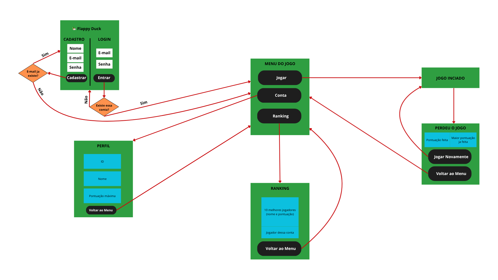
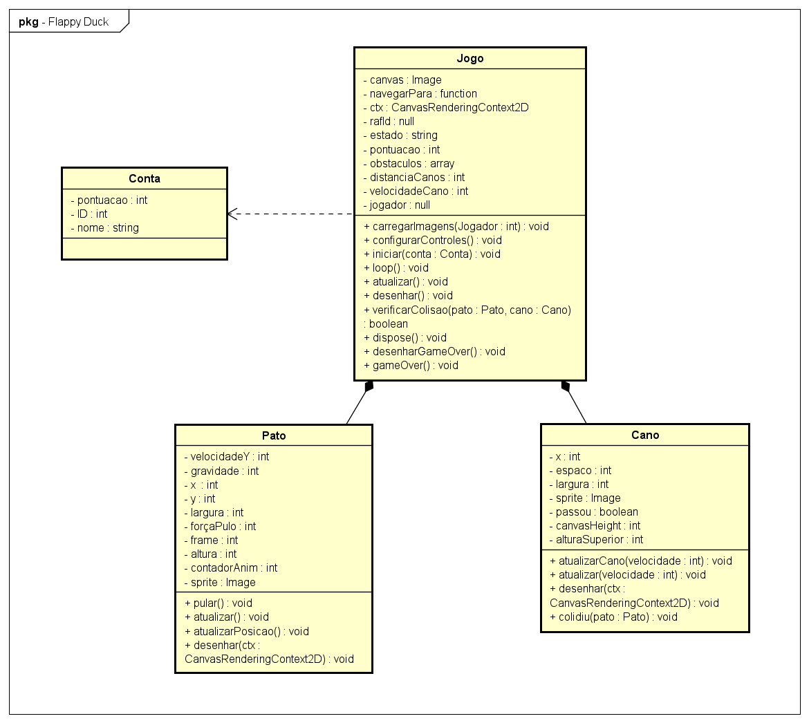

# Flappy Duck – Trio 1

## Integrantes

| Nome | Matrícula | GitHub |
|------|-----------|--------|
| Larissa R. Gabriel | 2024005516 | [@rademakerlarissa-web](https://github.com/rademakerlarissa-web) |
| Matheus Rodrigues Silva | 2024003816 | [@mathk4](https://github.com/mathk4) |
| Yuri Kauã Schwartz Melo | 2024001428 | [@yuri-yksm](https://github.com/yuri-yksm) |
---

## Descrição do projeto

> Nosso projeto tem como intuito criar um jogo divertido, inspirado no flappy bird, a fim de proporcionar entretenimento para os jogadores além de botar em pratica os conhecimentos adquiridos em aula. O jogo se trata em passar com o personagem (Pato) pelo máximo de obstaculos possiveis. Ele consta também com as opções de criar uma conta onde ficará registrada a pontuação em um banco de dados, mostrar Ranking onde exibira a pontuação de todos os jogadores, e "jogar" para iniciar o jogo. 



---

## Tecnologias utilizadas

- JavaScript ES6+ (Para deixar o front-end mais dinamico)
- HTML5 / CSS3 (Para estruturar e personalizar o front-end)
- Node.js (Para fazer o back-end)
- Banco de dados: PostgreSQL (Para armazenar os dados dos usuários)
- Supabase (Hospedagem do PostgreeSQL)
- Git/Github (Versionamento e armazenamento do código)

---

## Como executar o projeto

```bash
# Clone o repositório
git clone https://github.com/wilcilene/prog2-eco-2026-projetos.git

# Acesse a pasta do projeto
cd projetos/Larissa-Matheus-Yuri

# Instale as dependências (se houver)
npm install

```

Antes de executar o projeto, é importante criar uma conta e um projeto no Supabase.
Após criado o projeto, vá para "SQL Editor" no canto esquerdo do site do Supabase e rode o seguinte código:

```sql
-- TABELA DE USUÁRIOS
CREATE TABLE users(
	id_user INT GENERATED ALWAYS AS IDENTITY,
	username VARCHAR(20) NOT NULL,
	email VARCHAR(100) NOT NULL UNIQUE,
	password VARCHAR(255) NOT NULL,
	maximum_score INT DEFAULT 0,
	PRIMARY KEY (id_user)
);

-- ÍNDICE PARA BUSCAS POR PONTUAÇÃO
CREATE INDEX idx_score
ON users(maximum_score DESC);

```

Além disso, copie o conteudo do arquivo [.env.exemple](./.env.example), crie um arquivo chamado ".env" e cole o conteudo colado.

Ademais, no canto superior do Supabase, clique em "Connect" e depois em "ORM", vá até a parte de Configure ORM, copie o DATABASE_URL e cole para o .env, substituindo o [YOUR-PASSWORD] da url pela sua senha.

Desta forma, volte ao terminal e execute o projeto
```bash
# Execute
npm start

```
---
## Estrutura de pastas

```
app.js             ← configuração do servidor Express
server.js          ← ponto de entrada do backend
src/               ← código frontend e recursos do jogo
  ├── index.html     ← página principal do jogo
  ├── classes/       ← classes do jogo
  ├── controllers/   ← controladores de rota e lógica de views
  ├── css/           ← estilos do front-end
  ├── db/            ← configuração de conexão com banco de dados
  ├── images/        ← imagens usadas no front-end
  ├── models/        ← comunicação com o banco de dados
  ├── routes/        ← definição de rotas da aplicação
  ├── state/         ← gerenciamento de sessão e estado
  └── view/          ← templates e renderização de páginas
```
---
